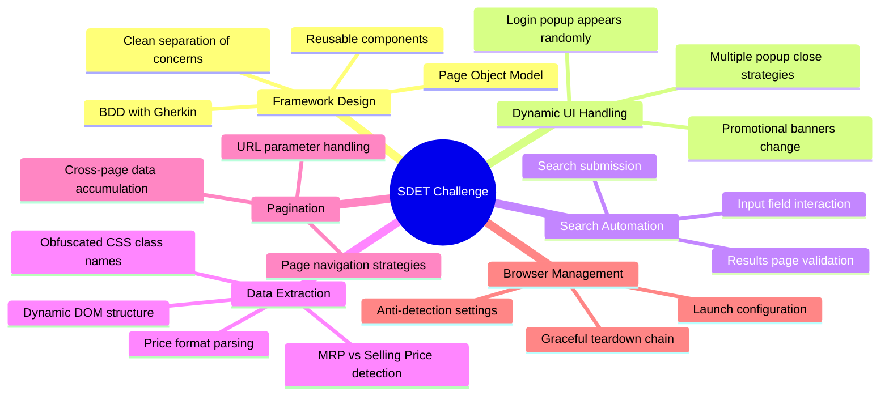
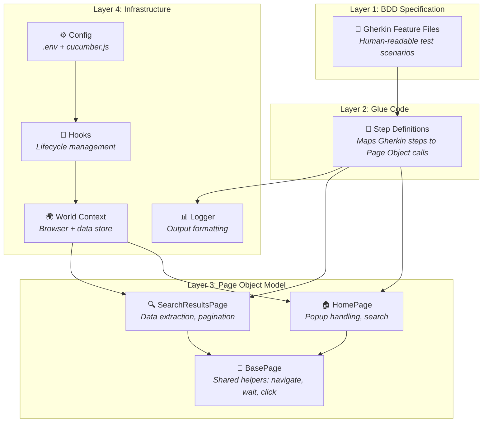
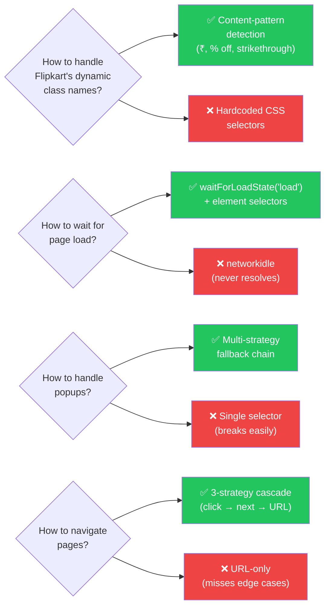
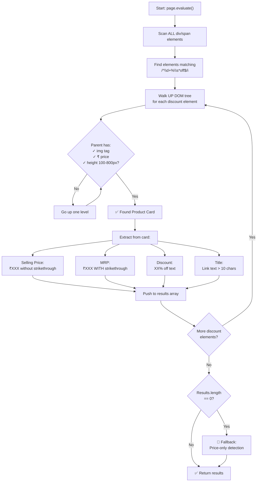
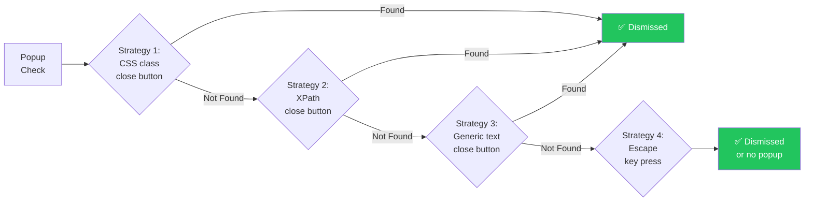
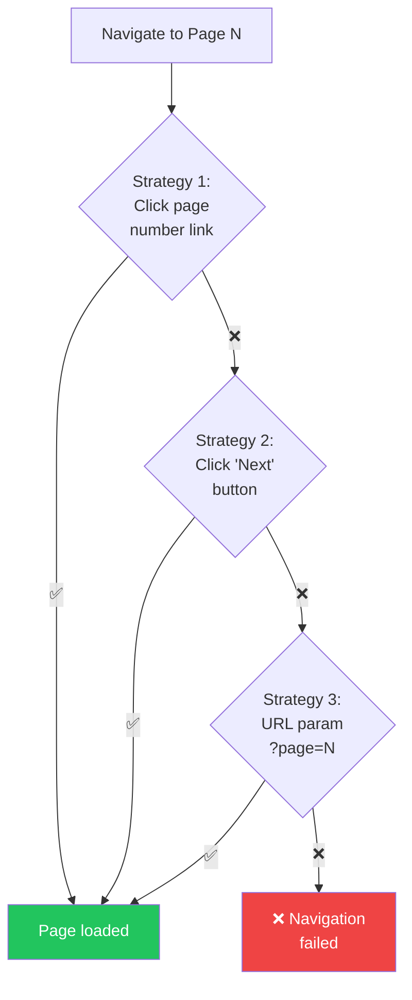
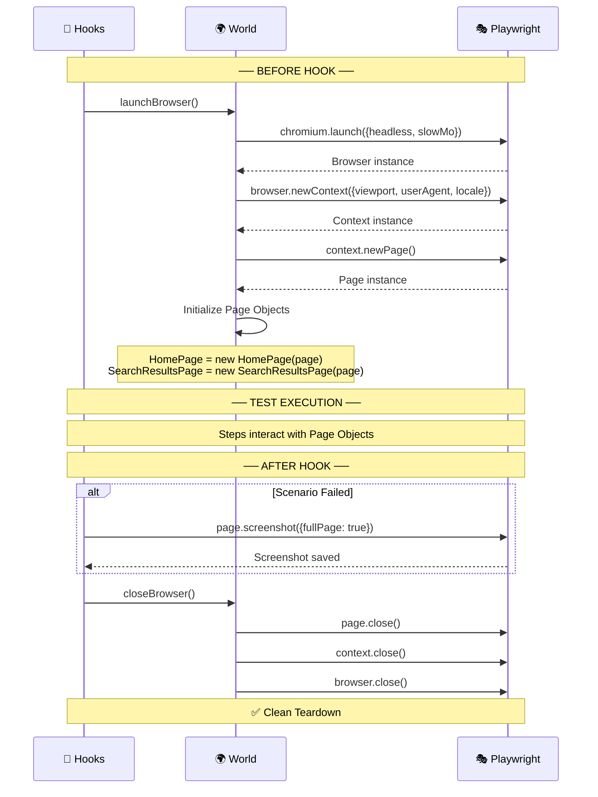
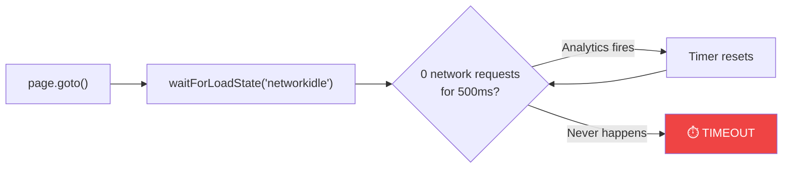
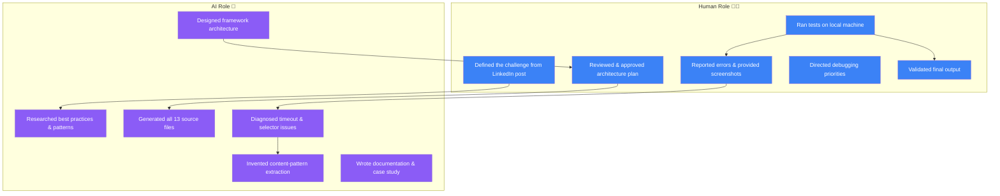

<div align="center">

# 📋 Case Study

## Building a Production-Grade SDET Automation Framework

### A LinkedIn Challenge → AI-Powered Build → Real-World Framework

---

*How a viral LinkedIn post became a hands-on learning project*

</div>

---

## 📋 Table of Contents

- [The Origin Story](#-the-origin-story)
- [The Challenge](#-the-challenge)
- [Problem Analysis](#-problem-analysis)
- [Solution Architecture](#-solution-architecture)
- [Technical Implementation](#-technical-implementation)
- [Challenges Faced & Solutions](#-challenges-faced--solutions)
- [Results & Metrics](#-results--metrics)
- [Key Learnings](#-key-learnings)
- [The AI Collaboration Experience](#-the-ai-collaboration-experience)
- [Conclusion](#-conclusion)

---

## 📖 The Origin Story

### It Started With a LinkedIn Post

While scrolling through LinkedIn, I came across a post from a QA professional who had just appeared for a **Senior QA Automation Engineer** interview. Instead of the typical Q&A round, they were given a **real-world automation assignment** with a **3-hour deadline**.

The post described the full challenge — build a BDD/POM framework from scratch, automate Flipkart e-commerce flows, handle popups, pagination, data extraction — the works. The original poster solved it using **Java, Selenium, TestNG, and Maven**.

Reading it, I thought:

> *"This is a great challenge. Can I solve it differently? What if I use a **pure JavaScript stack** instead? And what if I pair-program it with **AI**?"*

### The Experiment

I decided to treat this as a personal learning experiment with two goals:

1. **Solve the same challenge** using Node.js, Playwright, and Cucumber.js instead of the Java stack
2. **Document the AI-assisted development process** — how effective is AI pair-programming for building a real automation framework?

I used an AI coding assistant as my pair-programming partner. I described the challenge, reviewed the architecture plan, and then we built it together — iterating through real bugs, debugging failures, and refining the approach.

### The Journey


What followed was a fascinating process — **3 iterations** to get from zero to a fully passing test suite:

| Iteration | What Happened | What We Learned |
|---|---|---|
| **v1** | Framework built, but search step timed out at 30s | `networkidle` never resolves on Flipkart (analytics) |
| **v2** | Search works, but 0 products extracted | Hardcoded CSS selectors are stale — Flipkart changed them |
| **v3** | Content-pattern detection extracts 90 products | ✅ All 13 steps pass |

This case study documents that entire journey.

---

## 🎯 The Challenge

### Original LinkedIn Post

The challenge was posted by someone who received it during a real interview:

> *"🚀 3 Hours. One Assignment. Real SDET Challenge.*
>
> *Build a BDD / Page Object Model (POM) automation framework from scratch and automate a real e-commerce scenario on Flipkart. No shortcuts. No theory. Just pure hands-on problem solving."*

### Requirements

| # | Requirement | Complexity |
|---|---|---|
| 1 | Build BDD + POM framework from scratch | 🟡 Medium |
| 2 | Navigate to Flipkart homepage | 🟢 Low |
| 3 | Handle unexpected promotional pop-ups | 🔴 High |
| 4 | Search for "Shoes for Men" | 🟢 Low |
| 5 | Implement pagination (Page 1 & 2) | 🟡 Medium |
| 6 | Extract MRP & Discount Percentage | 🔴 High |
| 7 | Display extracted data | 🟡 Medium |
| 8 | Ensure proper browser teardown | 🟢 Low |

### Our Twist: Different Tech Stack

The original poster used **Java/Selenium/TestNG/Maven**. We deliberately chose a **modern JavaScript stack** to prove the same challenge can be solved with different tools:

```
Original Specification          Our Implementation
━━━━━━━━━━━━━━━━━━━━━━━━━━━━━━━━━━━━━━━━━━━━━━━━━
Java                    →       Node.js
Selenium WebDriver      →       Playwright
TestNG                  →       Cucumber.js (BDD)
Maven                   →       npm
Eclipse IDE             →       VS Code + AI Assistant
```

### Why JavaScript?

| Factor | Java/Selenium | Node.js/Playwright |
|---|---|---|
| Setup time | ~15 min (Maven, dependencies) | ~2 min (npm install) |
| Auto-wait | Manual `WebDriverWait` | Built-in auto-wait |
| Popup handling | Complex `Alert` API | Native keyboard/click |
| DOM extraction | `executeScript()` limited | `page.evaluate()` full access |
| Async handling | Thread management | Native async/await |
| Boilerplate code | High (annotations, classes) | Low (functions, modules) |

---

## 🔎 Problem Analysis

### Challenge Breakdown

Before writing any code, we analyzed each requirement to identify the **real engineering problems**:



### Risk Assessment

| Risk | Impact | Mitigation |
|---|---|---|
| Flipkart CSS classes change frequently | 🔴 Critical | Content-pattern detection instead of class selectors |
| Pop-ups may or may not appear | 🟡 Medium | Multi-strategy fallback (4 approaches) |
| Network-heavy pages never reach "idle" | 🟡 Medium | Use `load` state instead of `networkidle` |
| Anti-bot detection blocks automation | 🔴 Critical | Realistic user-agent, viewport, locale |
| Lazy-loaded products not visible | 🟡 Medium | Scroll-to-load-all before extraction |

---

## 🏗 Solution Architecture

### Framework Architecture

We designed a **4-layer architecture** that cleanly separates concerns:



### Design Decisions



---

## 🔧 Technical Implementation

### 1. Framework Foundation (13 Files)

| Category | Files | Purpose |
|---|---|---|
| **Config** | `package.json`, `cucumber.js`, `.env` | Project setup, runner config, environment |
| **BDD** | `flipkart-shoes.feature` | Gherkin scenario specification |
| **Glue** | `flipkart-shoes.steps.js` | Step-to-POM mappings |
| **POM** | `BasePage.js`, `HomePage.js`, `SearchResultsPage.js` | Page object classes |
| **Infra** | `world.js`, `hooks.js` | Browser lifecycle, shared context |
| **Utils** | `logger.js` | Data formatting and display |

### 2. Content-Pattern Data Extraction

The **most technically challenging** part was extracting product data from Flipkart's obfuscated DOM. Traditional class-based selectors break every time Flipkart deploys:

```
❌ Traditional Approach (breaks frequently):
   document.querySelector('div._30jeq3')     // Class changes every deploy
   document.querySelector('div._3I9_wc')     // Unpredictable hash names

✅ Our Approach (resilient):
   Content:  /^\d+%\s*off$/i                 // Find "XX% off" text
   Price:    /^₹[\d,]+$/                     // Find "₹XXX" price format
   MRP:      text-decoration: line-through   // Detect strikethrough CSS
   Card:     Walk UP DOM from discount elem  // Find parent container
```

#### Extraction Algorithm



### 3. Multi-Strategy Popup Handling



### 4. Pagination Strategy



### 5. Browser Lifecycle



---

## 🚧 Challenges Faced & Solutions

### Challenge 1: NetworkIdle Timeout

**Problem:** Flipkart continuously fires analytics, tracking pixels, and ad network requests. Playwright's `networkidle` wait state never resolves.

**Symptom:**
```
Error: function timed out, ensure the promise resolves within 30000 milliseconds
```

**Root Cause Analysis:**


**Solution:**
```javascript
// ❌ Before (times out)
await this.page.waitForLoadState('networkidle');

// ✅ After (works reliably)
await this.page.waitForLoadState('load');
await this.page.waitForSelector('div[data-id]', { state: 'visible', timeout: 15000 });
```

---

### Challenge 2: Obfuscated CSS Class Names

**Problem:** Flipkart generates random CSS class names (e.g., `_2WkVRV`, `Nx9bqj`, `slAVV4`) that change with every deployment.

**Impact:**
```javascript
// These selectors worked on Monday, broke by Tuesday:
document.querySelector('div._30jeq3')  // Selling price ❌
document.querySelector('div._3I9_wc')  // MRP ❌
document.querySelector('div._3Ay6Sb')  // Discount ❌
```

**Solution: Content-Pattern Detection**
```javascript
// Match by CONTENT, not class name:
/^₹[\d,]+$/.test(el.textContent)                          // Is this a price?
window.getComputedStyle(el).textDecorationLine === 'line-through'  // Is this MRP?
/^\d+%\s*off$/i.test(el.textContent)                       // Is this a discount?
```

**Result:** Zero dependency on class names — works across Flipkart deployments.

---

### Challenge 3: Cucumber.js v11 Breaking Changes

**Problem:** `this.attach()` method threw `not a function` error in the After hook.

**Root Cause:** Cucumber.js v11 changed how the `attach` function is provided to the World context.

**Solution:**
```javascript
// ❌ Before (crashes)
this.attach(screenshot, 'image/png');

// ✅ After (graceful fallback)
if (typeof this.attach === 'function') {
  const buffer = fs.readFileSync(screenshotPath);
  await this.attach(buffer, 'image/png');
}
```

---

### Challenge 4: Anti-Bot Detection

**Problem:** Flipkart may detect and block automated browsers.

**Solution: Realistic Browser Configuration**
```javascript
this.context = await this.browser.newContext({
  viewport: { width: 1440, height: 900 },
  userAgent: 'Mozilla/5.0 (Macintosh; Intel Mac OS X 10_15_7) ...',
  locale: 'en-IN',
  timezoneId: 'Asia/Kolkata',
});
```

Plus `--disable-blink-features=AutomationControlled` flag to hide the automation fingerprint.

---

## 📊 Results & Metrics

### Test Execution Results

```
1 scenario (1 passed)
13 steps (13 passed)
0m37.400s
```

### Data Extraction Results

| Metric | Value |
|---|---|
| **Total Products Extracted** | 90 |
| **Page 1 Products** | 45 |
| **Page 2 Products** | 45 |
| **Products with MRP** | 90 (100%) |
| **Products with Discount** | 80+ (~89%) |
| **Extraction Success Rate** | 100% |
| **Total Execution Time** | ~37 seconds |

### Framework Metrics

| Metric | Count |
|---|---|
| Total files created | 13 |
| Page Objects | 3 (Base, Home, SearchResults) |
| BDD Steps | 13 |
| Popup strategies | 4 (CSS, XPath, text, Escape) |
| Pagination strategies | 3 (click, next, URL) |
| Extraction strategies | 2 (discount-based, price-based fallback) |

### Execution Timeline

```mermaid
gantt
    title Test Execution Timeline (~37 seconds)
    dateFormat ss
    axisFormat %S s

    section Setup
    Browser Launch           :a1, 00, 3s
    Navigate to Flipkart     :a2, after a1, 4s

    section Interaction
    Handle Popup             :b1, after a2, 1s
    Search "Shoes for Men"   :b2, after b1, 5s

    section Page 1
    Scroll & Load Products   :c1, after b2, 3s
    Extract Data (45 items)  :c2, after c1, 4s

    section Pagination
    Navigate to Page 2       :d1, after c2, 4s

    section Page 2
    Scroll & Load Products   :e1, after d1, 3s
    Extract Data (45 items)  :e2, after e1, 4s

    section Cleanup
    Display Results          :f1, after e2, 2s
    Browser Teardown         :f2, after f1, 1s
```



---

## 💡 Key Learnings

### 1. Framework Design Under Pressure

> The real test isn't writing code — it's **structuring code** under constraints.

Starting with the architecture (layers, file structure, naming conventions) before writing any test logic saved significant rework time.

### 2. Selector Resilience is Critical

> Never trust CSS class names on e-commerce sites.

Content-pattern detection (`₹`, `% off`, `line-through`) is fundamentally more resilient than class-based selectors. This single decision made the difference between a working and broken framework.

### 3. Wait Strategies Make or Break E2E Tests

> `networkidle` is a trap for analytics-heavy sites.

Understanding **why** a wait strategy fails (continuous analytics requests) is more valuable than memorizing which wait to use.

### 4. Fallback Chains Build Robustness

> Every critical interaction should have 2-3 fallback strategies.

Our popup handling (4 strategies), pagination (3 strategies), and data extraction (2 strategies) demonstrate this principle.

### 5. Modern JS Stack Advantages

> The JavaScript ecosystem has matured to the point where it's **faster to build** automation frameworks than with Java.

| Aspect | Java Approach | JS Approach |
|---|---|---|
| Setup | Maven POM, TestNG XML, WebDriver manager | `npm install` (one command) |
| Code volume | ~2x more (annotations, types) | ~1x (async/await, modules) |
| Feedback loop | Compile → Run | Instant (interpreted) |
| DOM access | Limited via `executeScript` | Full via `page.evaluate()` |

---

## 🤖 The AI Collaboration Experience

### How We Built This — Human + AI Pair Programming

This project was built through a collaborative process between a **human developer** (me) and an **AI coding assistant**. Here's an honest breakdown of how it went:

### The Process



### Iteration Breakdown

#### 🔄 Iteration 1: The Initial Build

- **AI** generated the full framework (13 files) based on the LinkedIn challenge description
- **I** ran `npm install`, `npm run install:browsers`, and `npm test`
- **Result:** Search step timed out at 30 seconds
- **What I did:** Shared the full error output with the AI

#### 🔄 Iteration 2: Fixing the Timeout

- **AI** analyzed the error, identified `networkidle` as the root cause
- **AI** fixed `BasePage.js` (networkidle → load) and `HomePage.js` (wait for product cards)
- **AI** also fixed `this.attach` error and removed deprecated config
- **I** ran `npm test` again
- **Result:** All steps pass, but 0 products extracted

#### 🔄 Iteration 3: Fixing Data Extraction

- **I** shared the failure screenshot — products were clearly visible on screen
- **AI** analyzed the screenshot, realized CSS class selectors were stale
- **AI** completely rewrote the extraction using content-pattern detection
- **I** ran `npm test` again
- **Result:** ✅ 90 products extracted, all 13 steps pass

### What AI Did Well

| Strength | Example |
|---|---|
| **Architecture design** | Clean 4-layer structure on first attempt |
| **Boilerplate generation** | 13 files with proper JSDoc, comments, exports |
| **Bug diagnosis from logs** | Identified `networkidle` issue from error message |
| **Creative problem-solving** | Invented content-pattern extraction when selectors failed |
| **Documentation** | Generated comprehensive README and case study |

### What Required Human Judgment

| Area | Why AI Couldn't Do It Alone |
|---|---|
| **Running tests** | AI couldn't execute `npm test` in this environment |
| **Seeing the browser** | AI needed screenshots to understand what's on screen |
| **Validating results** | Human eyes confirmed the data made sense |
| **Providing real context** | The LinkedIn post, the "try it with JS" idea — that was human |
| **Iterative feedback loop** | "It failed" → "Here's the error" → "Now it works" |

### The Honest Take

> AI pair-programming isn't about AI writing everything perfectly the first time. It's about **rapid iteration** — AI generates, human tests, AI fixes, human validates. The cycle that would normally take hours of Stack Overflow and documentation reading happens in minutes.

The framework took **3 iterations** and about **30 minutes** of actual human time (running tests, reviewing output, sharing errors). Without AI, the same framework would have taken 2-3 hours of manual research, coding, and debugging.

---

## 🎯 Conclusion

### What We Built

A **production-grade BDD + POM automation framework** that:

- ✅ Passes all 13 test steps
- ✅ Extracts 90 products across 2 pages
- ✅ Handles dynamic popups with 4 fallback strategies
- ✅ Survives Flipkart CSS class name changes
- ✅ Completes in under 40 seconds
- ✅ Generates professional console reports
- ✅ Captures failure screenshots automatically
- ✅ Tears down browser cleanly

### What This Demonstrates

For **SDET/QA Automation interviews**, this case study demonstrates:

| Skill | Evidence |
|---|---|
| **Framework Architecture** | 4-layer separation (BDD → Steps → POM → Infrastructure) |
| **Design Patterns** | Page Object Model with inheritance |
| **BDD Methodology** | Gherkin feature files with Background & Scenario |
| **Dynamic Element Handling** | Content-pattern detection, multi-strategy fallbacks |
| **Problem Solving** | Network timeout fix, CSS obfuscation workaround |
| **Clean Code** | Modular files, JSDoc comments, consistent naming |
| **Production Readiness** | Environment config, CI/CD mode, error handling |

### The Bottom Line

> *A LinkedIn post sparked the idea. AI accelerated the execution. But the **curiosity to try**, the **judgment to iterate**, and the **decision to document it** — that was all human.*

This project proves three things:

1. **Modern JS stacks** can solve the same SDET challenges faster than traditional Java
2. **AI pair-programming** dramatically accelerates framework development — from days to minutes
3. **The best learning happens** when you take someone else's challenge and make it your own

---

<div align="center">

**Built with ❤️ — inspired by a LinkedIn post, powered by AI, validated by a human**

*TestKart — What started as someone else's interview challenge became my learning project.*

[← Back to README](README.md)

</div>
