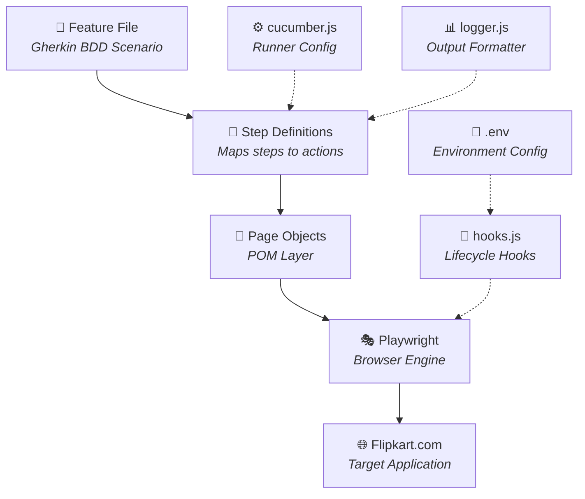
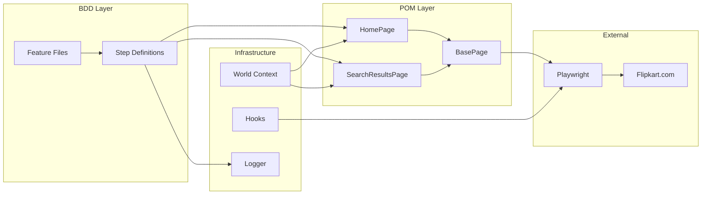
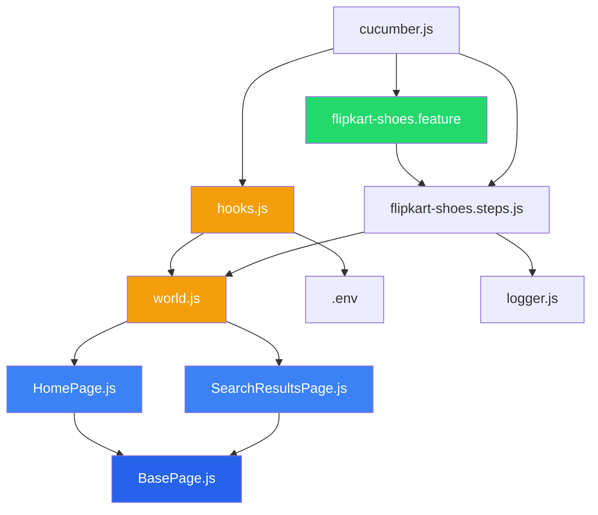
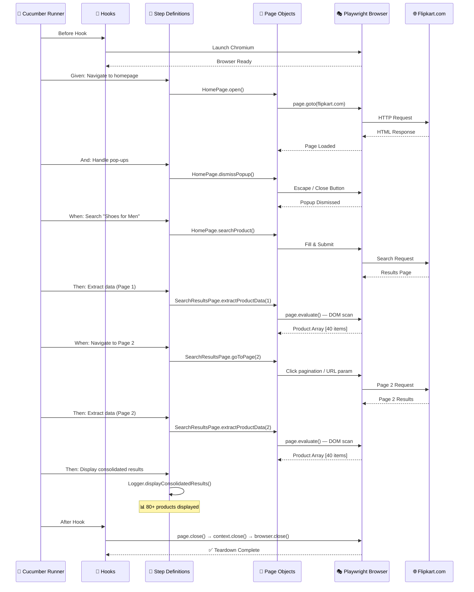
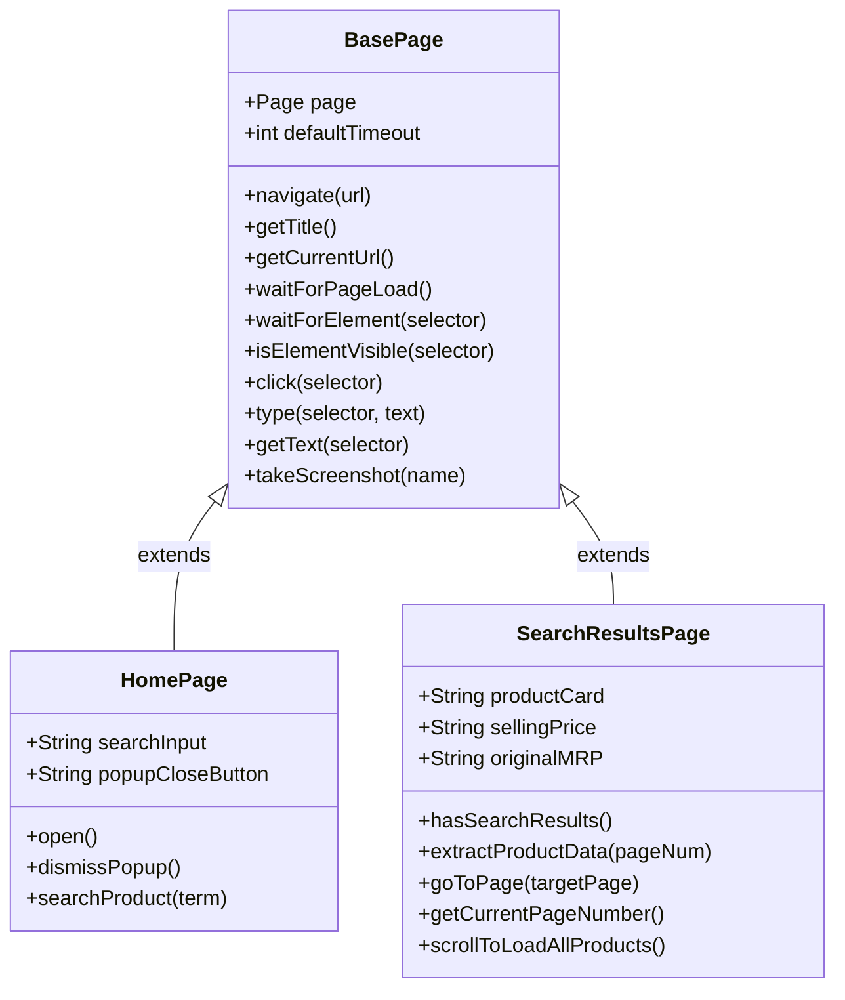
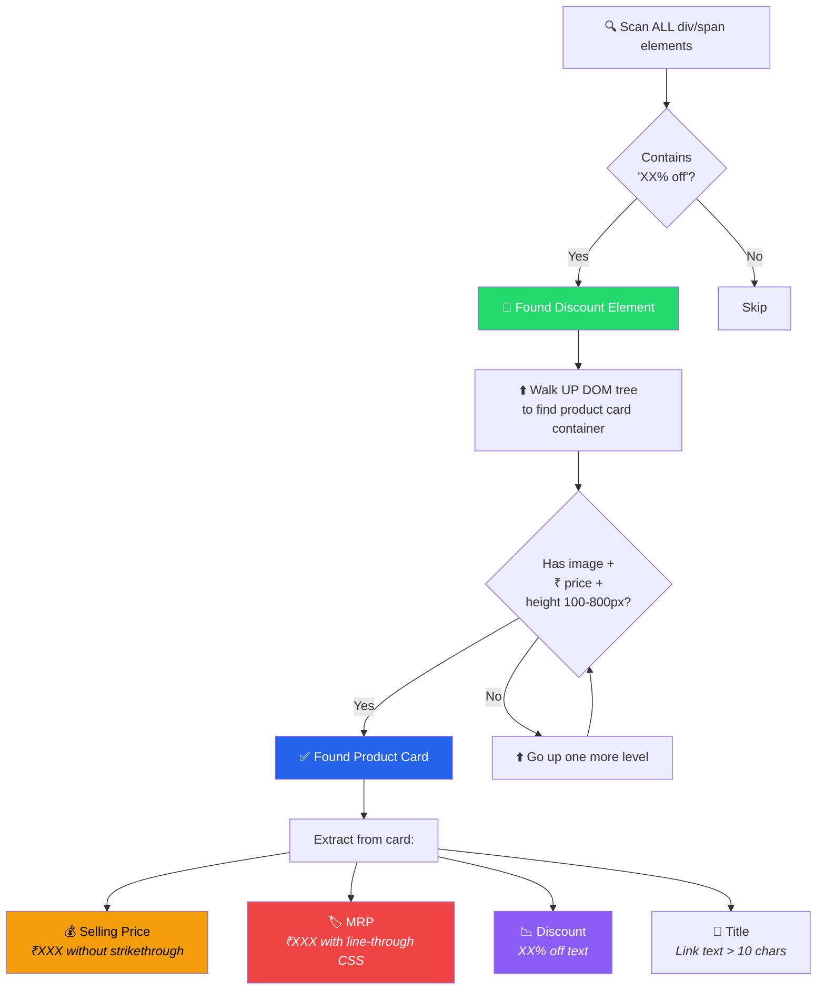
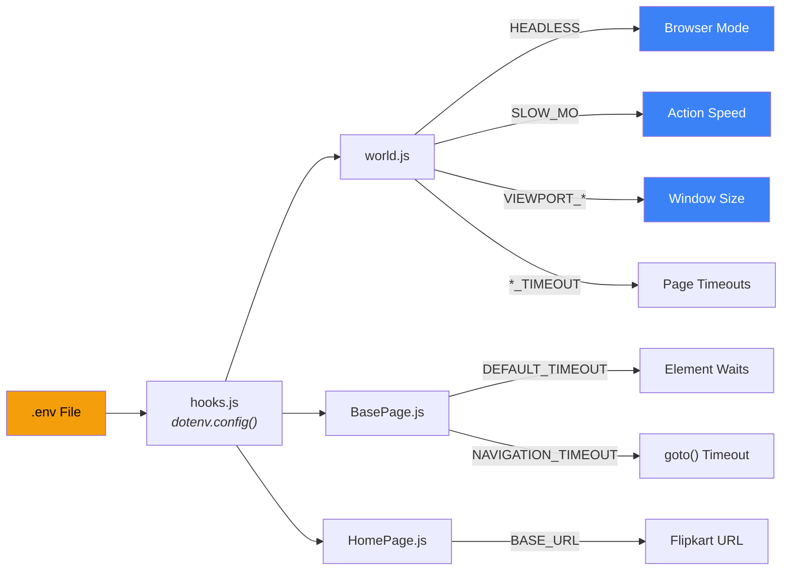
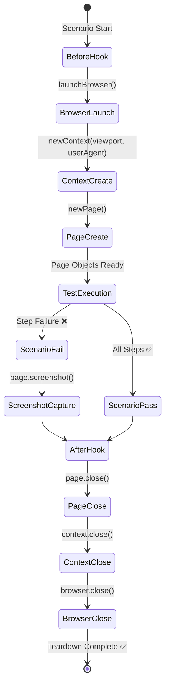

<

[](https://nodejs.org/)
[](https://playwright.dev/)
[](https://cucumber.io/)
[](LICENSE)

</div>

---

## 📋 Table of Contents

- [Challenge Overview](#-challenge-overview)
- [Tech Stack](#-tech-stack)
- [Architecture](#-architecture)
- [Project Structure](#-project-structure)
- [Quick Start](#-quick-start)
- [How It Works](#-how-it-works)
- [Page Object Model Design](#-page-object-model-design)
- [BDD Scenario](#-bdd-scenario)
- [Data Extraction Strategy](#-data-extraction-strategy)
- [Environment Configuration](#%EF%B8%8F-environment-configuration)
- [Test Lifecycle](#-test-lifecycle)
- [Sample Output](#-sample-output)
- [NPM Scripts](#-npm-scripts)
- [Design Decisions](#-design-decisions)

---

## 🎯 Challenge Overview

This framework was built as a **3-hour SDET interview challenge** — ported from the original Java/Selenium stack to a modern JavaScript ecosystem:

| Requirement | Status |
|---|:---:|
| Build BDD / POM automation framework from scratch | ✅ |
| Navigate to Flipkart homepage | ✅ |
| Handle unexpected promotional pop-ups | ✅ |
| Search for "Shoes for Men" | ✅ |
| Implement pagination (Page 1 & 2) | ✅ |
| Extract MRP & Discount Percentage | ✅ |
| Ensure proper browser teardown | ✅ |

---

## 🔧 Tech Stack

The original challenge specified Java/Selenium — this framework reimplements it using a **modern JS stack**:

```
┌─────────────────────────────────────────────────────────┐
│           Original Stack    →    JS Stack               │
├─────────────────────────────────────────────────────────┤
│           Java              →    Node.js                │
│           Selenium          →    Playwright              │
│           TestNG            →    Cucumber.js (BDD)       │
│           Maven             →    npm                     │
│           Eclipse           →    VS Code                 │
└─────────────────────────────────────────────────────────┘
```

| Technology | Role | Why This Choice |
|---|---|---|
| **Node.js** | Runtime | Fast, async-native, huge ecosystem |
| **Playwright** | Browser Automation | Auto-wait, superior popup handling, built-in assertions |
| **Cucumber.js** | BDD Framework | Gherkin syntax, readable by non-technical stakeholders |
| **dotenv** | Configuration | Environment-based config (headed/headless, timeouts) |
| **Page Object Model** | Design Pattern | Maintainable, reusable, scalable test architecture |

---

## 🏗 Architecture

### High-Level Data Flow



### Layer Responsibility



---

## 📁 Project Structure

```
testkart/
│
├── 📄 package.json                    # Dependencies & npm scripts
├── 📄 cucumber.js                     # Cucumber runner configuration
├── 📄 .env                            # Environment variables (URL, timeouts, browser)
├── 📄 .gitignore                      # Git exclusions
├── 📄 README.md                       # This file
│
├── 🥒 features/                       # ── BDD LAYER ──
│   └── flipkart-shoes.feature         # Gherkin scenario (human-readable)
│
├── 📝 step-definitions/               # ── GLUE CODE ──
│   └── flipkart-shoes.steps.js        # Maps Gherkin → Page Object calls
│
├── 📄 pages/                          # ── PAGE OBJECT MODEL ──
│   ├── BasePage.js                    # Abstract base (navigate, wait, click, screenshot)
│   ├── HomePage.js                    # Flipkart home (popup handling, search)
│   └── SearchResultsPage.js           # Search results (pagination, data extraction)
│
├── ⚙️ support/                         # ── FRAMEWORK INFRASTRUCTURE ──
│   ├── world.js                       # Custom Cucumber World (browser + data store)
│   └── hooks.js                       # Before/After hooks (launch, teardown, screenshots)
│
├── 🛠 utils/                           # ── UTILITIES ──
│   └── logger.js                      # Formatted console tables & statistics
│
├── 📊 reports/                        # Generated HTML/JSON test reports
└── 📸 screenshots/                    # Failure screenshots (auto-captured)
```

### File Dependency Graph



---

## 🚀 Quick Start

### Prerequisites

- **Node.js** v18+ installed
- **npm** v9+ installed

### Installation & Run

```bash
# 1️⃣  Clone and enter the project
cd testkart

# 2️⃣  Install dependencies
npm install

# 3️⃣  Install Playwright's Chromium browser
npm run install:browsers

# 4️⃣  Run the test suite (headed mode — watch the browser)
npm test

# 5️⃣  Or run in headless mode (for CI/CD)
npm run test:headless
```

---

## ⚡ How It Works

### End-to-End Test Flow



---

## 📄 Page Object Model Design

The POM pattern encapsulates all page interactions into **reusable, maintainable classes**:

### Class Hierarchy



### What Each Page Handles

| Page Object | Responsibilities | Key Methods |
|---|---|---|
| **BasePage** | Navigation, waits, clicks, screenshots | `navigate()`, `waitForPageLoad()`, `isElementVisible()` |
| **HomePage** | Flipkart homepage interactions | `open()`, `dismissPopup()`, `searchProduct()` |
| **SearchResultsPage** | Product data & pagination | `extractProductData()`, `goToPage()`, `scrollToLoadAllProducts()` |

---

## 🥒 BDD Scenario

The test scenario is written in **Gherkin** — a human-readable format that serves as both documentation and executable specification:

```gherkin
@flipkart @shoes @e2e
Feature: Flipkart Men's Shoes — Search & Data Extraction

  Scenario: Extract MRP and Discount Percentage from Page 1 and Page 2
    Given I navigate to the Flipkart homepage
    And I handle any promotional pop-ups
    When I search for "Shoes for Men"
    Then I should see search results for shoes

    When I scroll to load all products on the current page
    Then I extract MRP and Discount Percentage from page 1
    And I display the results for page 1

    When I navigate to page 2
    Then I should be on page 2

    When I scroll to load all products on the current page
    Then I extract MRP and Discount Percentage from page 2
    And I display the results for page 2

    Then I display the consolidated results from all pages
```

### Step Mapping Flow

```
Feature File (WHAT)  →  Step Definitions (HOW)  →  Page Objects (WHERE)
━━━━━━━━━━━━━━━━━━━━━━━━━━━━━━━━━━━━━━━━━━━━━━━━━━━━━━━━━━━━━━━━━━━━━━

"I navigate to homepage"  →  Given step  →  HomePage.open()
"I handle pop-ups"        →  Given step  →  HomePage.dismissPopup()
"I search for X"          →  When step   →  HomePage.searchProduct(X)
"I extract data from N"   →  Then step   →  SearchResultsPage.extractProductData(N)
"I navigate to page N"    →  When step   →  SearchResultsPage.goToPage(N)
"display consolidated"    →  Then step   →  Logger.displayConsolidatedResults()
```

---

## 🔍 Data Extraction Strategy

### The Problem

Flipkart uses **obfuscated CSS class names** (e.g., `_2WkVRV`, `Nx9bqj`) that change frequently with every deployment. Traditional selector-based scraping breaks constantly.

### The Solution: Content-Pattern Detection

Instead of relying on class names, our extraction uses **content patterns** and **CSS computed styles**:



### Detection Rules

| Data Point | Detection Method |
|---|---|
| **Discount** | Regex: `/^\d+%\s*off$/i` on leaf elements |
| **Selling Price** | Regex: `/^₹[\d,]+$/` + NO `text-decoration: line-through` |
| **MRP** | Regex: `/^₹[\d,]+$/` + HAS `text-decoration: line-through` |
| **Product Title** | `<a>` tag text > 10 chars, not starting with ₹ or % |
| **Product Card** | Ancestor with `` + price elements + height 100-800px |

---

## ⚙️ Environment Configuration

All runtime settings are controlled via the `.env` file:

```env
# Flipkart Base URL
BASE_URL=https://www.flipkart.com/

# Search Configuration
SEARCH_TERM=Shoes for Men

# Browser Configuration
HEADLESS=false          # true = CI mode, false = watch the browser
SLOW_MO=100             # Delay between actions (ms) for visibility
VIEWPORT_WIDTH=1440     # Browser window width
VIEWPORT_HEIGHT=900     # Browser window height

# Pagination
MAX_PAGES=2             # Number of pages to scrape

# Timeouts (ms)
DEFAULT_TIMEOUT=30000   # Wait timeout for elements
NAVIGATION_TIMEOUT=45000 # Page navigation timeout
```

### Where Each Variable Is Used



---

## 🔄 Test Lifecycle

### Browser Lifecycle Management



### Popup Handling Strategy

The framework uses a **multi-strategy fallback** approach for popup dismissal:

```
Strategy 1: CSS class-based close button     → Try first
    ↓ (failed)
Strategy 2: XPath-based close button         → Fallback
    ↓ (failed)
Strategy 3: Generic text-based close button  → Broader match
    ↓ (failed)
Strategy 4: Escape key press                 → Universal fallback
    ↓ (failed)
Result: Log "No popup detected" and continue → Graceful handling
```

### Pagination Strategy

```
Strategy 1: Click page number link directly   → Most precise
    ↓ (failed)
Strategy 2: Click "Next" button               → Common pattern
    ↓ (failed)
Strategy 3: URL parameter manipulation        → Most reliable fallback
             (?page=2 appended to URL)
```

---

## 📊 Sample Output

### Console Output

```
  ══════════════════════════════════════════
  🚀 TestKart — Launching Browser
  ── Mode: Headed
  ══════════════════════════════════════════

  🌐 Navigating to: https://www.flipkart.com/
  ✅ Page loaded: Online Shopping Site for Mobiles...
  🔍 Checking for promotional pop-ups...
  ✅ Pop-up dismissed using: Escape key
  🔎 Searching for: "Shoes for Men"
  ✅ Search results loaded for: "Shoes for Men"
  ✅ Search results are displayed

  📦 Extracting product data from Page 1...
  ✅ Extracted 45 products from Page 1

  ┌─────────────────────────────────────────────────────────────┐
  │  📄 PAGE 1 RESULTS — 45 Products Found                     │
  └─────────────────────────────────────────────────────────────┘
  ┌───┬────┬─────────────────────────────┬──────────┬─────────┬───────────┐
  │   │ #  │ Product                     │ Price    │ MRP     │ Discount  │
  ├───┼────┼─────────────────────────────┼──────────┼─────────┼───────────┤
  │ 0 │ 1  │ Exclusive Trendy Sports...  │ ₹256     │ ₹1,299  │ 80% off   │
  │ 1 │ 2  │ Trendy & Stylish Runnin... │ ₹240     │ ₹999    │ 75% off   │
  │ 2 │ 3  │ ES-21 Hockey Walking/...   │ ₹452     │ ₹1,999  │ 77% off   │
  │...│... │ ...                         │ ...      │ ...     │ ...       │
  └───┴────┴─────────────────────────────┴──────────┴─────────┴───────────┘

  📄 Navigating to Page 2...
  ✅ Navigated to Page 2

  📦 Extracting product data from Page 2...
  ✅ Extracted 45 products from Page 2

  ╔══════════════════════════════════════════════════╗
  ║  📊 CONSOLIDATED RESULTS — ALL PAGES            ║
  ╠══════════════════════════════════════════════════╣
  ║  📄 Page 1: 45 products                         ║
  ║  📄 Page 2: 45 products                         ║
  ╠══════════════════════════════════════════════════╣
  ║  📦 Total Products Extracted: 90                 ║
  ║  💰 Products with MRP: 90                        ║
  ║  🏷️  Products with Discount: 80                  ║
  ╚══════════════════════════════════════════════════╝

  🎯 Total products extracted: 90
  ✅ Data extraction complete!

  🧹 Tearing down browser...
  ✅ Browser teardown complete

  ══════════════════════════════════════════
  🏁 TestKart — Test Execution Complete
  ──────────────────────────────────────────
  📊 Reports: reports/cucumber-report.html
  📸 Screenshots: screenshots/
  ══════════════════════════════════════════

  1 scenario (1 passed)
  13 steps (13 passed)
  0m37.400s
```

---

## 📦 NPM Scripts

| Script | Command | Description |
|---|---|---|
| `npm test` | `npx cucumber-js` | Run all BDD scenarios (headed) |
| `npm run test:headed` | `HEADLESS=false npx cucumber-js` | Explicitly headed mode |
| `npm run test:headless` | `HEADLESS=true npx cucumber-js` | Headless mode (CI/CD) |
| `npm run install:browsers` | `npx playwright install chromium` | Download Chromium |
| `npm run pretest` | `mkdir -p reports screenshots` | Create output directories |

---

## 💡 Design Decisions

### Why Playwright over Selenium?

| Feature | Selenium | Playwright |
|---|---|---|
| Auto-wait for elements | ❌ Manual waits | ✅ Built-in |
| Popup handling | ❌ Complex | ✅ Native support |
| `page.evaluate()` for DOM | ❌ Limited | ✅ Full browser context |
| Network interception | ❌ Requires proxy | ✅ Built-in |
| Speed | 🐢 Slower | 🚀 Faster |
| Multi-browser support | ✅ Yes | ✅ Yes |

### Why Content-Based Extraction?

Flipkart uses **obfuscated, randomly-generated CSS class names** that change with every deployment (e.g., `_2WkVRV`, `Nx9bqj`, `slAVV4`). Our approach:

- ❌ ~~Class-based selectors~~ → Break with every Flipkart deploy
- ✅ **Content patterns** (₹ symbol, % off, strikethrough CSS) → Resilient to UI changes

### Why Custom Cucumber World?

The `World` object serves as a **shared context** across all step definitions:

```
World = {
  browser,              // Playwright Browser instance
  context,              // Browser Context (viewport, cookies)
  page,                 // Active Page
  homePage,             // HomePage POM instance
  searchResultsPage,    // SearchResultsPage POM instance
  productsData: []      // Accumulated product data across pages
}
```

---

## 🔮 Extending the Framework

### Adding a New Page Object

```javascript
// pages/ProductDetailPage.js
const BasePage = require('./BasePage');

class ProductDetailPage extends BasePage {
  constructor(page) {
    super(page);
    // Define locators
  }
  // Define methods
}
module.exports = ProductDetailPage;
```

### Adding a New Scenario

```gherkin
# features/flipkart-electronics.feature
@electronics
Scenario: Search and extract laptop prices
  Given I navigate to the Flipkart homepage
  When I search for "Laptops"
  Then I extract pricing data from page 1
```

---

<div align="center">

**Built with ❤️ for the SDET Community**

*TestKart — Because real SDET interviews test what you can build, not what you can memorize.*

</div>
]]>
